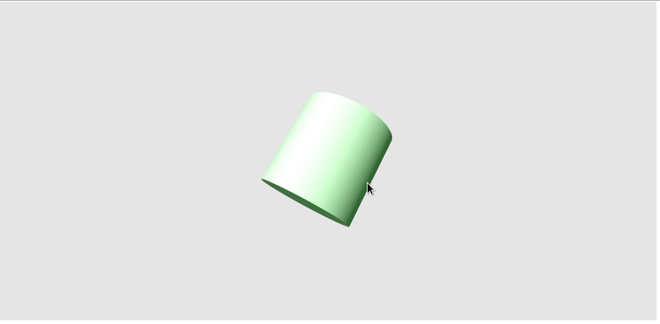

# Projects written with OpenAI's [ChatGPT](https://chat.openai.com/chat)

Small projects that explore AI-assisted programming.

## JS Minesweeper

### [Play the game here](https://sorrge.github.io/minesweeper/)

### [Full ChatGPT conversation log](https://sorrge.github.io/minesweeper/chat_log.html)

100% of the code is written by ChatGPT in a single dialog with iterative refinement. ~500 LOC. [Detailed description](minesweeper/Readme.md)

Features debugging, code abstraction using comments.

 

## Classic Literature Summaries

### [The summaries website](https://sorrge.github.io/classics/)
### [Partial chat log](https://sorrge.github.io/classics/chat_log.html)

ChatGPT is asked to provide a list of genres, then the list of prominent classic works in each genre, then a summary of each work. All these requests are automated, and their results are assembled into a website. Nearly all the code is generated by ChatGPT with some adjustments. ~300 LOC. [Detailed description](classics/Readme.md)

Features scripted AI interactions, extracting structured data from the AI.

 

## WebGL cylinder

### [The animation](https://sorrge.github.io/cylinder/)

### [Code](cylinder/)

A quick WebGL demo featuring 3D shape generation, shaders, a light, matrices, transformations, and animation loop. Light follows the mouse. All ChatGPT with small edits. ~400 LOC written in about 2 hours. I know OpenGL but not WebGL, so all of its API details is on the AI.
