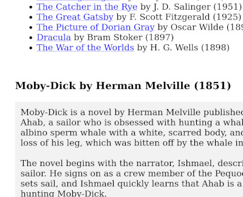

# Classic literature summaries autogenerated by ChatGPT

## [The summaries website](https://sorrge.github.io/classics/)
## [Partial chat log](https://sorrge.github.io/classics/chat_log.html)

The generated code is in files `extract_summaries.py`, `index.html.template`, `genre.html.template`, and `styles.css`. It's about 300 LOC total.

In this project, I explored the possibility of OpenAI's [ChatGPT](https://chat.openai.com/chat) interacting with itself programmatically. It refuses to do so directly, but can be coerced by saying things like "I have a function that returns a result given a text request". I used revChatGPT to submit requests. Using ChatGPT, I made scripts to extract the literature genres, prominent works, and their summaries. Then a script, again written with ChatGPT, turned everything into a website.

The service was unstable and the chat had to be restarted many times, so I only have a partial log.

This time, for efficiency, I edited the generated code to change margins and do other small fixes. Used this way, ChatGPT can actually help to code faster. For example, I didn't even know about the `jinja2` library, and it was the AI who showed me how to do HTML templates easily. The whole project took maybe 5 hours to complete. About 95% of the code is  unchanged ChatGPT production.

While writing this code, the AI easily understood the relationship between submitted prompts and the result. It was able to change both Python parts of the code and the English prompts in it.

The summaries themselves are OK quality. Such summaries were present in the training data, so it's not surprising that it was able to generate them well.
