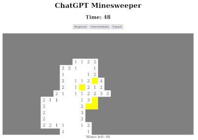

# Minesweeper game written with ChatGPT

This project is an HTML Minesweeper game written as a result of my interaction with OpenAI's [ChatGPT](https://chat.openai.com/chat). At the time of writing, ChatGPT is available for free.

## [Play the game here](https://sorrge.github.io/minesweeper/)

## [Full ChatGPT conversation log](https://sorrge.github.io/minesweeper/chat_log.html)

The generated code is in `index.html` and `minesweeper.js` files.

To explore coding capabilities of ChatGPT, I made this game in a limited zero-code fashion. I ask the AI what I want and follow its instructions, pretending to have little understanding of the code. I strictly followed the following rules:
 
 - Every single line of code must originate from the AI. I don't adjust or fix even a single character of the generated code, even if the AI told me to do so. I insist on it generating complete lines and telling me where to put them. As a proof, you can find line-by-line source attribution referring to the conversation log in the files `index.html.line_src` and `minesweeper.js.line_src`
 - I don't tell it how exactly to change the code. Any code that I post to it is a copy of its own previously generated code.
 - I use the first reasonable, sensible answer. I only retry generation when the reply is nonsense, such as the AI pretending to be me, as it sometimes does, or not continuing an interrupted block of code. There were very few such retries. If the answer is obviously wrong, such as asking me to change a nonexistent function, I don't use retry button, but argue with it in the next message instead. If the change introduces bugs, I accept it and make it fix the bugs later from the description of behavior.

I was able to make all the features that I wanted. At some points, it clearly didn't "get it", and had to be guided. In most cases, it was enough to point to the relevant part of code and ask "Could there be a problem here?" and it can fix it. There was one more difficult problem with a non-square board display, where I had to hint it with the direct cause.

The AI needed a good deal of hand-holding. Its memory of the conversation and the code is fairly long, but in the project of this scale (~500 LOC) it kept forgetting details of the code, such as how it's structured and names of functions. When it faces a problem, it goes for the most superficial solution (undefined variable? Define it in the global scope), which is typically wrong. It gets stuck in this idea, and needs a nudge in the right direction to proceed. This nudge requires at least some knowledge of the code from the user.

The whole project took about a day to complete. Most of the time I was waiting for the AI to respond - that day the servers were under heavy load and I had sometimes about 20 request timeouts in a row.

For me personally, the AI didn't offer much of an advantage. I'd finish the project much faster on my own. For someone who absolutely doesn't have any understanding of the code, it will be impossible to use this method of programming for anything non-trivial. There may exist a group of people who understand the code enough, but have difficulties writing their own code, who may benefit from this type of interactive AI-assisted coding.

The AI writes bad code. It tends to copy-paste already written chunks, uses global variables a lot, adds useless code in futile attempts to fix errors. It behaves pretty much like a beginner programmer. Upon request, it can do specific refactoring and cleanup, but it never suggests it.

It's amazing that this is possible at all.